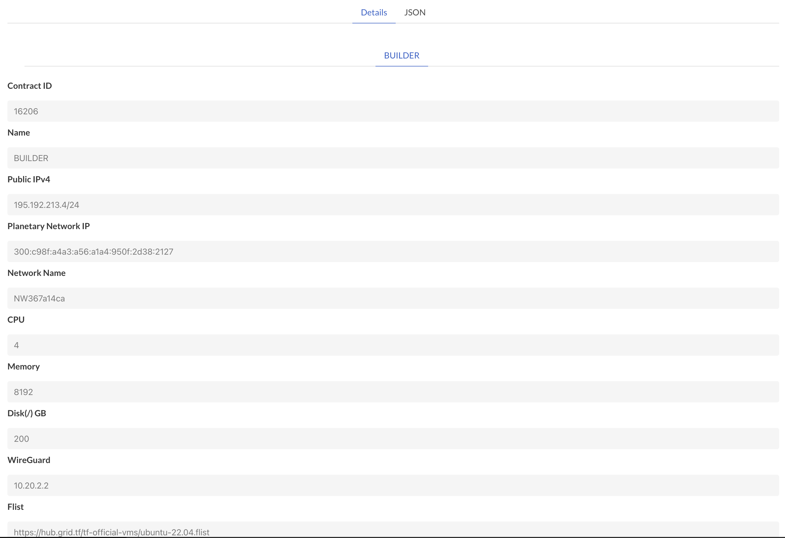

# Getting Started Ubuntu

## Deploy a VM on TFGrid

steps

- go to https://play.grid.tf/#/
- chose VM deployer, make sure to have some TFT in your wallet
- I chose 200 GB of storage and 8 Gb of memory

result is something like

  

Login to your VM with

```bash
#the -A forwards your SSH key
ssh -A root@195.192.213.4
```

## Prepare the VM

inside the VM do the following

- docker and docker compose

```bash
#install docker and builder
curl https://raw.githubusercontent.com/threefoldtech/builders/master/scripts/installers/docker.sh > /tmp/install.sh && bash /tmp/install.sh
```

## Build the base dockers


```
cd ~/code/github/threefoldtech/builders/builders/generic/
bash build_all.sh
```

